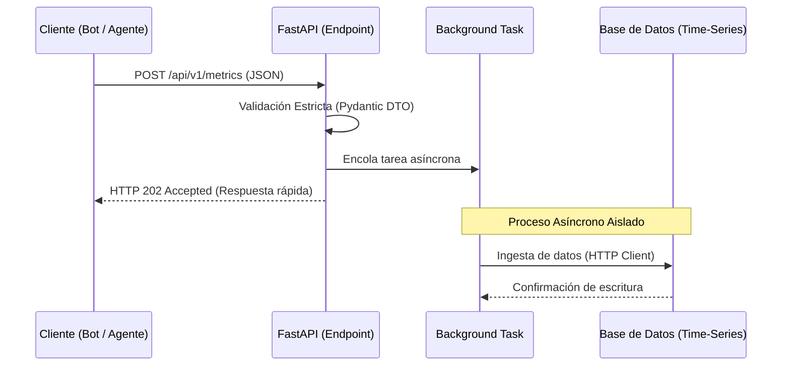
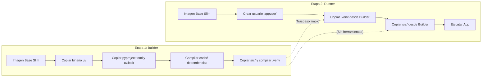
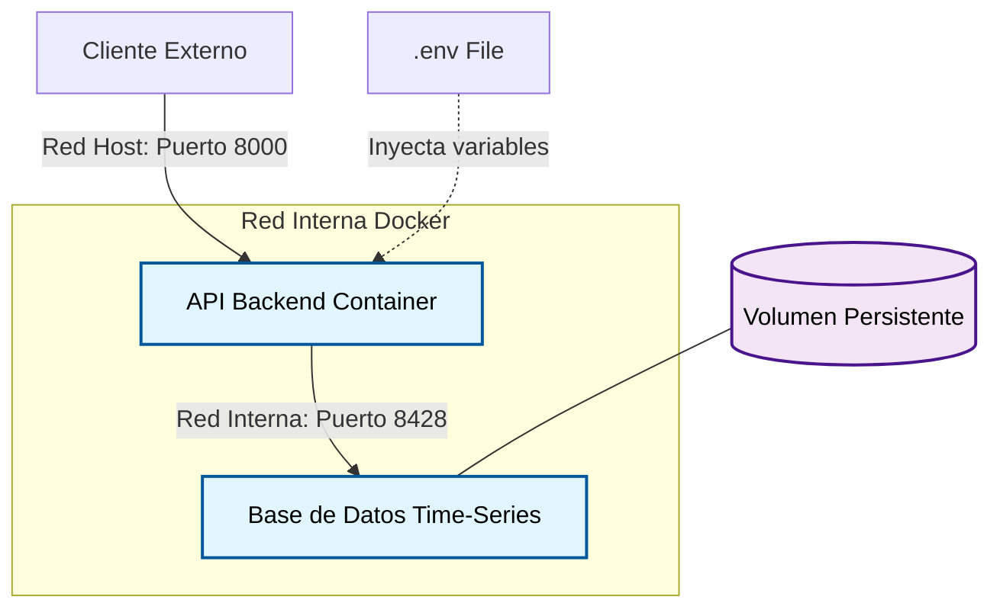

# Plantilla Base: Arquitectura y Puesta en Marcha (Python Backend)

Este documento describe la metodología estándar, los patrones y las herramientas empleadas para inicializar este proyecto. Sirve como referencia arquitectónica para garantizar que el código sea escalable, seguro y fácil de mantener.

---

## 1. Estructura y Gestión del Proyecto

**Herramienta:** `uv`
**Estándares:** PEP 621 (`pyproject.toml`)

* **Patrón `src/` Layout (Encapsulación):** Al inicializar el proyecto con `uv init --app`, forzamos que el código resida dentro de un directorio `src/`.
  * *Buenas prácticas:* Evita conflictos de importación (`sys.path`), garantiza que las pruebas se ejecuten contra el paquete instalable real y facilita copiar selectivamente el código fuente a los contenedores Docker.
* **Gestión de Dependencias Determinista:** Uso de `uv.lock` para garantizar compilaciones reproducibles (idénticas en desarrollo y producción).
* **Separación de Entornos:** División estricta entre dependencias de *producción* (core) y *desarrollo* (herramientas de QA).

## 2. Configuración y Secretos

**Herramientas:** `pydantic-settings`, archivo `.env`

* **Patrón *12-Factor App*:** Extraer toda la configuración (URLs, credenciales, puertos) del código fuente y leerla desde variables de entorno.
* **Patrón *Fail-Fast* (Fallo Rápido):** Al tipar la configuración con Pydantic, si falta una variable de entorno o tiene el tipo incorrecto, la aplicación se detiene inmediatamente durante el arranque. Esto evita fallos silenciosos en tiempo de ejecución.
* **Seguridad:** El archivo `.env` se excluye explícitamente en el `.gitignore`.

## 3. Diseño de la API y Dominio

**Herramientas:** FastAPI, Pydantic, `httpx`

* **Patrón *Data Transfer Object (DTO)*:** Uso de modelos Pydantic (`BaseModel`) para definir contratos estrictos de entrada/salida. Se validan los datos (ej. límites máximos/mínimos) antes de que toquen la lógica de negocio.
* **Patrón *Adapter / Gateway*:** Aislamiento de las llamadas externas (como enviar datos a la base de datos). Si la base de datos cambia, solo se modifica el adaptador, no los endpoints de la API.
* **Procesamiento Asíncrono (I/O No Bloqueante):** Uso de `BackgroundTasks` y clientes asíncronos (`httpx.AsyncClient`) para liberar la conexión del cliente inmediatamente mientras el trabajo pesado ocurre en segundo plano.

### Flujo de Ejecución (Secuencia)

## 4. Aseguramiento de Calidad (QA) y Formato

**Herramientas:** `pre-commit`, `Ruff`

* **Patrón *Shift-Left Testing/Linting*:** Descubrir y solucionar problemas de código lo antes posible en el ciclo de desarrollo.
* **Automatización de Git Hooks:** `pre-commit` intercepta el comando `git commit` y obliga a pasar los linters (Ruff check) y formateadores (Ruff format) antes de permitir que el código entre al repositorio.
* **Estilo Unificado:** Eliminación de debates sobre el estilo de código; la herramienta dicta el estándar moderno de Python automáticamente.

## 5. Estrategia de Contenedores (Docker)

**Herramientas:** Docker

* **Patrón *Multi-stage Build* (Construcción Multietapa):** Divide la construcción para que la imagen final no contenga herramientas de compilación que amplíen la superficie de ataque o el tamaño.
* **Principio de Menor Privilegio (Seguridad):** Se crea un usuario específico (`appuser`) sin permisos de *root*. La aplicación se ejecuta bajo este usuario para mitigar vulnerabilidades de escalada de privilegios.
* **Aislamiento del Entorno Virtual:** Seguimos aislando las dependencias en un `/app/.venv` dentro de Docker para no interferir con el sistema operativo base del contenedor.

### Proceso de Construcción (Multi-stage)

## 6. Orquestación Local

**Herramientas:** Docker Compose

* **Infraestructura como Código (IaC):** Definición declarativa de todos los servicios satélites en un único archivo `docker-compose.yml`.
* **Aislamiento de Red:** Los servicios se comunican por redes internas de Docker usando nombres DNS internos, no exponiendo puertos al host a menos que sea estrictamente necesario.

### Topología de Red y Componentes

